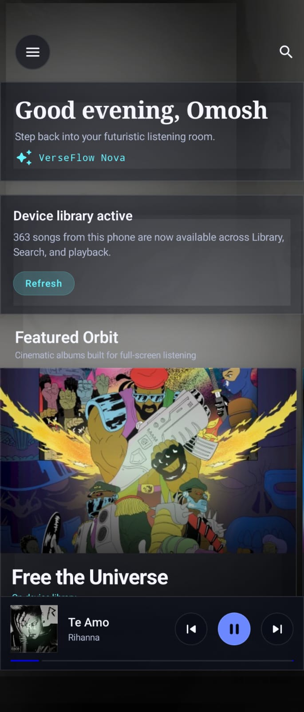
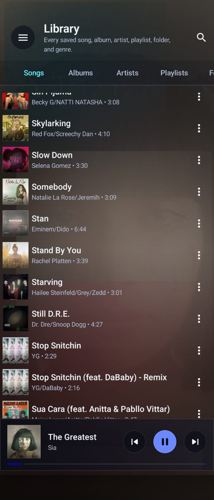
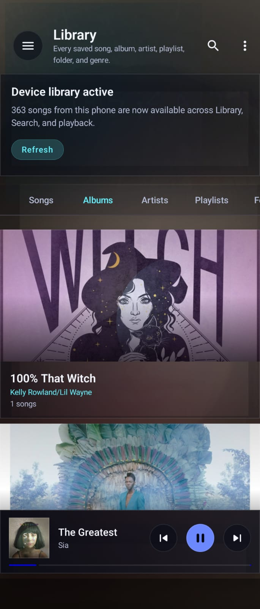
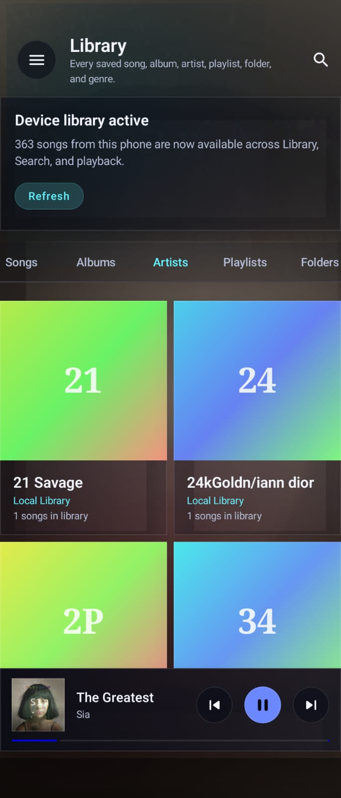
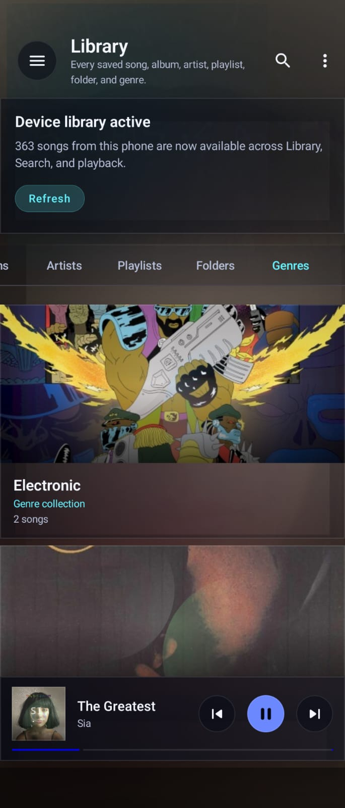
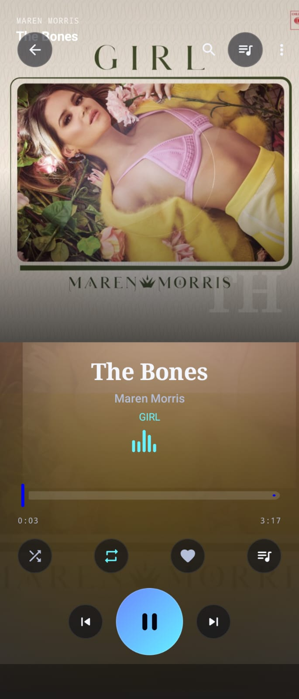
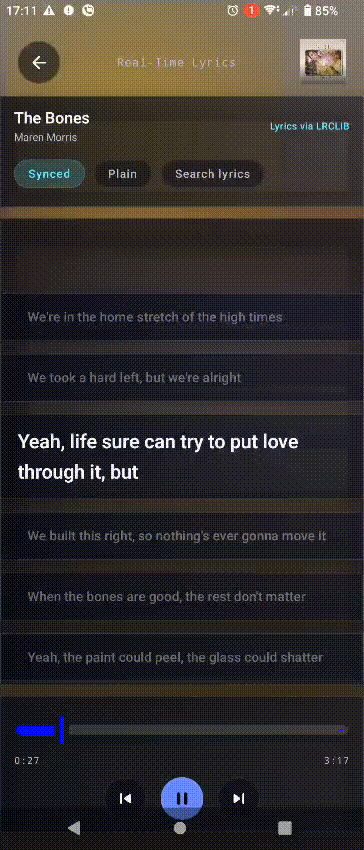
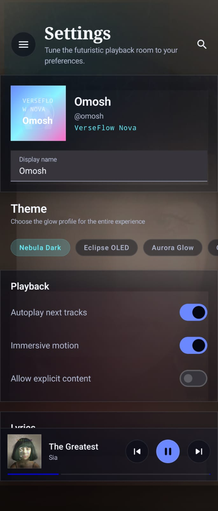

# VerseFlow

VerseFlow is a premium Android music player concept built with Kotlin, Jetpack Compose, and Material 3.

It is designed around one core experience: a cinematic local music player with a polished real-time lyrics screen.

[Download Here](./app/build/outputs/apk/debug/app-debug.apk)

The app currently focuses on:

- beautiful Android UI and motion
- local on-device music playback
- album-art-reactive visuals
- synced and plain lyrics discovery
- manual lyrics selection
- media-session-backed background playback
- reusable Compose architecture that can be extended later

This project is frontend-first, but it is no longer just a static UI prototype. It now includes real local playback, media notifications, lyrics lookup, caching, and device-library browsing.

## Status

Current state:

- Android app is runnable and usable on a real device
- local songs can be loaded from device storage through `MediaStore`
- real audio playback works for local files
- playback continues in the background for local songs
- media notification and lock-screen controls are wired through Media3 `MediaSessionService`
- synced and plain lyrics can be fetched, cached, and manually selected
- editing music info is implemented as app-only overrides
- songs can be hidden from VerseFlow or deleted from device storage

This is still a debug-stage app, not a production release.

## Main Features

### Music library

- Browse local songs
- Browse albums
- Browse artists
- Browse playlists
- Browse folders
- Browse genres
- Search across songs, albums, artists, and playlists

### Playback

- Play local songs from device storage
- Mini player at the bottom of the app
- Full Now Playing screen
- Previous / play-pause / next
- Shuffle and repeat
- Play queue
- Album-focused playback
- Playlist playback
- Artist top-track playback

### Lyrics

- Dedicated full-screen lyrics view
- Synced lyrics when available
- Plain lyrics fallback when synced lyrics are unavailable
- Manual lyrics search and manual match selection
- Cached lyrics for previously matched songs
- `Jump Live` behavior for returning to the active lyric after manual scrolling

### Device integration

- Reads local music through Android `MediaStore`
- Background playback through `MediaSessionService`
- Media-style notification for local playback
- Lock-screen controls
- Bluetooth / headset media-button support through the media session path

### Personalization

- Multiple theme presets:
  - `Nebula Dark`
  - `Eclipse OLED`
  - `Aurora Glow`
  - `Cobalt Luxe`
- User display name in Settings
- App-only metadata overrides for title, artist, album, and genre
- Song hiding inside VerseFlow without deleting the real file

## Screens

The app currently includes:

- Splash
- Home
- Library
- Search
- Play Queue
- Now Playing
- Lyrics
- Album Detail
- Artist Detail
- Playlist Detail
- Settings

## Pages

Screenshots for the main app pages are stored in the `media/` folder.

### Home

Path: `media/home.jpeg`



### Songs Page

Path: `media/songspage.jpeg`



### Album Detail

Path: `media/album.jpeg`



### Artist Detail

Path: `media/artist.jpeg`



### Genres

Path: `media/genres.jpeg`



### Now Playing

Path: `media/nowplaying.jpeg`



### Lyrics Page

Path: `media/lyrics.gif`



### Settings

Path: `media/settings.jpeg`



## Gestures and Interactions

### Now Playing

- Swipe left to move to the next song
- Swipe right to move to the previous song
- Swipe up over the artwork area to open lyrics
- Tap the mini player to open the full player

### Lyrics

- Swipe right to return to Now Playing
- Scroll manually through lyrics without being forced back immediately
- Tap `Jump Live` to return to the lyric line that matches the current playback position

## Lyrics Pipeline

VerseFlow does not use audio fingerprinting yet.

Lyrics are currently found using metadata and safe fallback sources in this order:

1. embedded lyrics inside the local file
2. LRCLIB lookup
3. lyrics.ovh fallback for plain lyrics
4. manual search and manual match selection

Additional behavior:

- The app prefers synced lyrics over plain lyrics when a strong match exists
- The app uses normalized title and artist matching to handle cases like:
  - `24 Hours (feat. 2 Chainz)`
  - `TeeFLii/2 Chainz`
- Found lyrics are cached locally so the app does not need to search every time
- If the app cannot verify a lyrics match safely, it shows `No lyrics found` instead of attaching risky lyrics from the wrong song

### Important note about synced lyrics

Not every song online has timestamped lyrics.

So a song may still show:

- synced lyrics
- only plain lyrics
- no lyrics found

depending on source availability and match confidence.

## Music Sources

VerseFlow currently supports:

- local audio files visible to Android through `MediaStore`

It does not support:

- DRM-protected offline downloads from streaming apps like Spotify, Apple Music, or YouTube Music

## Song Actions

From song overflow menus, the app supports:

- Add to playlist
- Add to play queue
- Add / remove favourites
- Remove from VerseFlow
- Delete from device
- Open artist
- Open album
- Edit Music Info

### Remove from VerseFlow

This hides the song inside VerseFlow only.

It does not delete the real file from the phone.

### Delete from device

This attempts real file deletion for local songs.

The app uses Android’s system-approved media deletion path where applicable.

### Edit Music Info

This is currently app-only.

That means edited title, artist, album, and genre are only changed inside VerseFlow. The real audio file tags are not rewritten yet.

## Themes

Theme switching is available in Settings.

Current presets:

- `Nebula Dark`: original futuristic dark theme
- `Eclipse OLED`: cleaner near-black theme
- `Aurora Glow`: warmer colorful premium theme
- `Cobalt Luxe`: elegant blue-family theme centered around `#00f`

## Notifications and Background Playback

For local songs, VerseFlow now uses Media3 session-based playback.

That means:

- audio can continue in the background
- Android shows a media notification
- lock-screen controls are available
- Bluetooth/headset playback buttons can control the session

Important limitation:

- demo/mock songs are not real files, so true background audio behavior mainly applies to local on-device tracks

## Settings: What Works and What Is Still Placeholder

### Working settings

- Display name
- Theme selection
- Synced lyrics default preference
- Stored preference toggles for future use

### Partially implemented / placeholder settings

- `Autoplay next tracks`
  - stored, but not fully enforced across every playback path
- `Immersive motion`
  - stored, but not yet driving a full app-wide motion toggle system
- `Allow explicit content`
  - stored, but not filtering the library yet
- `Download over Wi-Fi only`
  - stored, but there is no real download pipeline yet
- `Language`
  - stored, but the app is not localized into multiple languages yet
- `Storage & Cache`
  - still a placeholder section, no clear-cache or download-management UI yet

## Tech Stack

- Kotlin
- Jetpack Compose
- Material 3
- Android Media3
- ExoPlayer
- `MediaSessionService`
- SharedPreferences for lightweight persistence

## Project Structure

```text
app/src/main/java/com/example/verseflow/
├── data/
├── model/
├── ui/
│   ├── components/
│   ├── navigation/
│   ├── preview/
│   ├── screens/
│   │   ├── album/
│   │   ├── artist/
│   │   ├── home/
│   │   ├── library/
│   │   ├── lyrics/
│   │   ├── player/
│   │   ├── playlist/
│   │   ├── queue/
│   │   ├── search/
│   │   ├── settings/
│   │   └── splash/
│   └── theme/
├── MainActivity.kt
├── VerseFlowApp.kt
├── VerseFlowPlaybackService.kt
└── VerseFlowViewModel.kt
```

## Key Files

- `MainActivity.kt`
  - app entry point
- `VerseFlowApp.kt`
  - app shell, navigation host setup, mini player, dialogs
- `VerseFlowViewModel.kt`
  - app state, playback orchestration, library mutations, lyrics state
- `VerseFlowPlaybackService.kt`
  - Media3 background playback service
- `ui/navigation/VerseFlowNavigation.kt`
  - screen routing
- `data/DeviceAudioStoreLoader.kt`
  - local device library loading
- `data/LrcLibLyricsRepository.kt`
  - synced lyrics lookup
- `data/LyricsOvhFallbackRepository.kt`
  - plain lyrics fallback
- `data/LyricsCacheStore.kt`
  - cached lyrics persistence
- `data/LibraryCustomizationStore.kt`
  - hidden songs and app-only metadata overrides

## Build and Run

### Requirements

- Android Studio
- JDK 17
- Android device or emulator

### Run in Android Studio

1. Open the project in Android Studio
2. Let Gradle sync finish
3. Select a real device or emulator
4. Run the `app` configuration

### Build from terminal

```bash
JAVA_HOME='/Applications/Android Studio.app/Contents/jbr/Contents/Home' ./gradlew --no-daemon :app:assembleDebug --console=plain
```

### APK output

```text
app/build/outputs/apk/debug/app-debug.apk
```

## Permissions

The app uses:

- `READ_MEDIA_AUDIO` on Android 13+
- `READ_EXTERNAL_STORAGE` on older Android versions
- `INTERNET` for lyrics lookup
- foreground media playback permissions for background audio

## Current Limitations

- No backend or cloud sync
- No real streaming service integration
- No real download manager
- No equalizer, crossfade, or advanced audio controls
- No file-tag rewriting yet
- No full localization yet
- No account/auth system
- No analytics / crash-reporting integration
- No production release signing or Play Store packaging yet

## Play Store Readiness

VerseFlow is not yet production-ready just because the UI is polished.

Before Play Store release, the project should still add:

- release signing and App Bundle generation
- crash reporting
- Android vitals monitoring
- more device QA
- playback resumption polish
- notification and media-session edge-case testing
- clearer licensing strategy for lyrics sources

## Future Roadmap

Possible next steps:

- production hardening for Play Store
- playback resumption after reboot / system dismissal
- equalizer and audio enhancements
- richer cache and storage controls
- advanced lyrics features
  - translation
  - karaoke word timing
  - lyric source picker
- real metadata rewriting to audio files
- desktop version for macOS

## MacBook Version Plan

The cleanest path for a Mac version is Compose Multiplatform.

Suggested roadmap:

1. Move shared models, theme, and UI state into shared modules
2. Keep Android-specific media and library APIs behind interfaces
3. Add a desktop playback implementation
4. Add macOS local-library scanning and artwork extraction
5. Reuse as much of the current Compose UI as possible
6. Package as a native macOS desktop app

## Notes

- This repository currently represents a premium Android music-player prototype with real local playback and a strong lyrics-first experience.
- The project has intentionally prioritized design polish and local lyrics UX before platform expansion.

## License

No license file has been added yet.

If you plan to open-source or distribute this project publicly, add a proper `LICENSE` file first.
